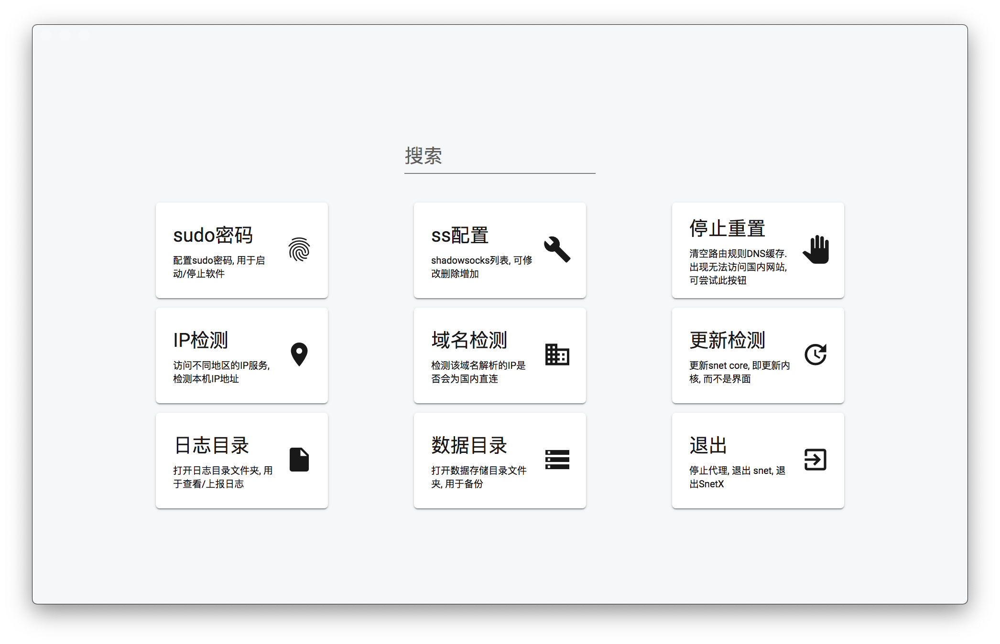

# SnetX

一款透明代理(`transparent proxy`)工具[`snet`](https://github.com/monsterxx03/snet) 的 `MacOS`(`OS X`) 可视化界面

## 帮助文档

- 配置界面快捷搜索支持 设置项/Shadowsocks 配置搜搜/IP 检测/域名检测/快捷指令等
  

- 退出 `SnetX` 仅能通过 托盘(`Tray`) 中点击 `退出` 菜单, 使用 `Cmd+Q` 仅仅隐藏配置界面

- 如遇到无法访问网络, 请点击托盘的 `设置` 打开设置界面, 再点击 `停止重置` 按钮后, 查看是否网络正常

### 支持的快捷指令

- `h/help/帮助/帮助文档`: 打开帮助文档
- `IP`: 检测本机 IP 地址
- `password/密码`: 设置 `sudo` 密码
- `init/初始化`: 初始化向导
- `log/日志`: 打开日志目录文件夹
- `db/存储`: 打开数据存储目录文件夹
- `exit/quit`: 退出

### 网络不正常可能原因

- `SnetX` 崩溃
- [`snet`](https://github.com/monsterxx03/snet) 有端口冲突
- 启动多个`SnetX`
- SS 服务器无法访问
- 本身网络有异常

## Q&A

- 为什么需要开机密码(sudo 密码)

  > 1. [`snet`](https://github.com/monsterxx03/snet) 运行本身需要 `sudo` 执行
  > 2. 停止 [`snet`](https://github.com/monsterxx03/snet) 采用的是 `kill`

- 开机密码(sudo 密码) 存储于哪里?

  > 密码存储使用 [keytar](https://github.com/atom/node-keytar), 存储于 钥匙串访问(`Keychain Access.app`)

- 设置界面找不到

  > 托盘(`Tray`) 中点击 `设置` 菜单即可显示.
  > 原因: 本程序设置界面并非主要操作, 托盘(`Tray`)才是主要操作, 所以默认会销毁/隐藏

- 如何退出

  > 退出 `SnetX` 仅能通过 托盘(`Tray`) 中点击 `退出` 菜单, 使用 `Cmd+Q` 仅仅隐藏设置界面

- 域名检测如何实现的

  > 用 `dig` 解析 IP, 查看 IP 是否为国内 IP, 是则显示直连. [原作者解释](https://github.com/monsterxx03/snet/issues/4#issuecomment-590224681)

- 无法访问网络, 即使退出了 `SnetX`

  > 请点击托盘的 `设置` 打开设置界面, 再点击 `停止重置` 按钮后, 查看是否网络正常

- 每次打开都要求输入开机密码 / 每次启动失败, 需要设置开机密码
  > 打开 访达-应用程序-实用工具-钥匙串访问(`Keychain Access.app`), 右键"登录"锁定钥匙串，然后再解锁即可. [原文](https://github.com/desktop/desktop/issues/3625#issuecomment-352319346)

## 问题反馈

如果是针对界面操作的问题, 请在此 repo 反馈, 如果是针对 [`snet`](https://github.com/monsterxx03/snet) 相关, 请前往 [`snet`](https://github.com/monsterxx03/snet) 反馈, 本项目仅仅是一个可视化界面

## 本地如何开发

1. 安装 [Node.js](https://nodejs.org/en/), 版本 `>=v12.14.1`
2. `git clone https://github.com/xinshangshangxin/snet-x`
3. 进入`snet-x`, 执行 `npm run start:pre`
4. 下载 [snet](https://github.com/monsterxx03/snet) `brew install jq && bash .github/shells/download-github-release.sh`
5. `cd main && npx electron-rebuild`. [原文](https://github.com/electron/electron-rebuild#how-does-it-work)
6. 本地实时预览, 第一个命令窗口: `cd render && npm start`; 第二个命令窗口: `cd main && npm start`, 其中`render`实时刷新, 而 `main` 需要手动重启
7. 本地构建: `npm run build:local`

## Thanks

- [snet](https://github.com/monsterxx03/snet)
- [angular-electron](https://github.com/maximegris/angular-electron)
- [SwitchHosts](https://github.com/oldj/SwitchHosts)
- [jsQR](https://github.com/cozmo/jsQR)
- [keytar](https://github.com/atom/node-keytar)
- 等等

## TODO

- [x] 二维码扫描
- [x] 退出后重新打开 "Attempting to call a function in a renderer window that has been closed or released."
- [x] cmd+q 拦截
- [x] 菜单: 数据存储目录(nedb)
- [x] 菜单可快捷配置翻墙模式: 1.全局翻墙 2. 国内直连 3. 继承配置设置
- [x] 更新 snet, 内置检测更新并下载
- [x] 打开设置页面 loading 动画处理
- [x] 交互 loading 动画处理(ip 检测, 二维码扫描)
- [ ] 手动选择外部 snet 路径
- [ ] 导入导出备份
- [ ] 配置 排序
- [ ] SnetX 更新检查
- [ ] 返回按钮统一处理
- [ ] _其它 snet 配置支持_
- [ ] _speedtest_
